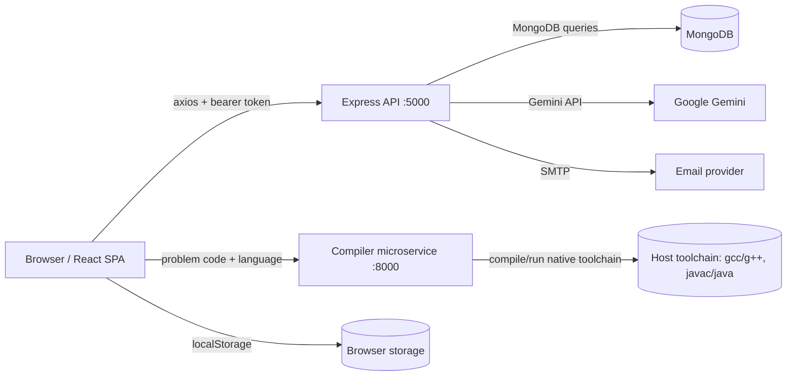

# PROJECT_OVERVIEW

## 1. Project Summary

This repository implements a competitive programming online judge called Online Judge / Algo Judge. The frontend is a React single-page application for browsing problems, editing and running code, viewing submissions and profile stats, and using AI hints/chat assistance. The backend is an Express API backed by MongoDB, and a separate compiler microservice compiles and executes user code for C, C++, and Java. The platform supports authentication, Google login, password reset, problem management, submission history, and AI-generated hints through Gemini.

Target users are regular problem solvers, authenticated contestants who want to submit and track solutions, and administrators who manage the problem set. The core use cases are: browse published problems, write code in the Monaco editor, run against sample or custom inputs, submit against public and hidden test cases, inspect past submissions and profile statistics, and request AI help when stuck.

## 2. Tech Stack

### Languages, frameworks, libraries, and versions

| Layer | Package / Tool | Version | Purpose |
| --- | --- | --- | --- |
| Frontend | React | 19.1.0 | UI runtime |
| Frontend | React DOM | 19.1.0 | DOM rendering |
| Frontend | Vite | 6.3.5 | Dev server and build tool |
| Frontend | React Router DOM | 7.6.2 | Client routing |
| Frontend | Redux Toolkit | 2.8.2 | State management |
| Frontend | Monaco Editor React | 4.7.0 | Code editor |
| Frontend | Axios | 1.10.0 | HTTP client |
| Frontend | React Toastify | 11.0.5 | Toast notifications |
| Frontend | React Icons | 5.5.0 | Icon set |
| Frontend | @react-oauth/google | 0.12.2 | Google OAuth UI |
| Backend | Express | 4.18.2 | HTTP API |
| Backend | Mongoose | 8.0.3 | MongoDB ODM |
| Backend | JSON Web Token | 9.0.2 | Token auth |
| Backend | bcryptjs | 2.4.3 | Password hashing |
| Backend | Helmet | 7.1.0 | Security headers |
| Backend | express-rate-limit | 7.1.5 | Request throttling |
| Backend | express-validator | 7.0.1 | Input validation |
| Backend | CORS | 2.8.5 | Cross-origin access |
| Backend | Morgan | 1.10.0 | HTTP logging |
| Backend | Nodemailer | 7.0.5 | Email delivery |
| Backend | google-auth-library | 10.1.0 | Google ID token verification |
| AI | @google/genai | 1.8.0 | Gemini client |
| AI | @google/generative-ai | 0.24.1 | Gemini client compatibility |
| Compiler | Express | 4.18.2 | Compiler HTTP service |
| Compiler | UUID | 11.1.0 | Temp file naming |

Frontend uses JavaScript with ES modules. Backend and compiler are also JavaScript ES modules on Node.js. Dockerfiles target Node 18, and the compiler image additionally installs OpenJDK 17, GCC, and G++.

### Database(s)

MongoDB is the only persistent database. It stores users, problems, submissions, and hint usage. There is no Redis, BullMQ, Celery, Kafka, or other queue/worker system in this repo. The frontend also uses browser `localStorage` for code persistence and trie-learning state, but that is not backend persistence.

## 3. Architecture

### High-level component diagram



### Major folders and purpose

- `client/`: React frontend, Monaco editor, problem UI, profile UI, AI chatbot, code persistence.
- `server/`: Express API, authentication, problem/submission logic, AI integration, MongoDB models.
- `Compiler/`: Separate code execution microservice that writes code to temp files and runs language toolchains.
- `client/public/`: Static assets and PWA-related files.
- `client/src/components/`: Reusable UI widgets such as the editor, chatbot, recent submissions, and auth forms.
- `client/src/pages/`: Top-level pages such as Home, Problem, and Profile.
- `client/src/services/`: Frontend HTTP wrappers around the backend API.
- `client/src/utils/`: Browser-side persistence and autocomplete utilities.
- `server/controllers/`: HTTP handlers for auth, problems, AI, and user profile/submission data.
- `server/models/`: MongoDB schemas for User, Problem, Submission, and HintUsage.
- `server/middleware/`: Auth, rate limiting, and error handling middleware.
- `server/routes/`: Route wiring for auth, problem, user, and AI endpoints.
- `server/utils/`: Gemini helpers, email sender, submission wrappers, compiler helpers, and seeding scripts.

### End-to-end submission flow

1. The user opens a problem in `client/src/pages/Problem.jsx`.
2. The page loads problem data with `client/src/services/api.js:getProblem()`.
3. On run, submit, or custom test, the client POSTs the code and language to the backend.
4. The backend route `server/routes/problem.js` forwards to `server/controllers/problem.js`.
5. `runCode`, `submitSolution`, or `runCustomTestCase` wraps the user solution with a generated harness from `server/utils/codeWrappers.js` and enforces the expected function signature from `server/utils/signatureUtils.js`.
6. The backend POSTs the wrapped code to the compiler service at `process.env.COMPILER_URL` or `process.env.VITE_COMPILER_URL` depending on controller path.
7. `Compiler/index.js` writes the code to temp files, compiles it, executes it, captures stdout/stderr, and returns the result.
8. The backend compares stdout to expected output for each test case, stores a `Submission` document, updates problem counters, and returns the verdict to the client.
9. The frontend renders the verdict and refreshes recent submissions and profile statistics.

### Active route wiring snapshot

```js
app.use(deserializeUser);
app.use(apiLimiter);

app.use('/api/v1/auth', authRoutes);
app.use('/api/v1/problems', problemRoutes);
app.use('/api/v1/user', userRoutes);
app.use('/api/v1/ai', aiRoutes);
```

The active execution path is `server/controllers/problem.js`. `server/controllers/problemExecution.js` exists but is not imported by any route file in the current tree, so it appears to be legacy or duplicated code.

## 4. Code Execution / Judging Engine

### How untrusted code is compiled and executed

The compiler service is a separate Express app in `Compiler/index.js`. Its `/compile` endpoint accepts `{ language, code, input }`, sanitizes line breaks, writes source to a temporary file under `user_codes/`, optionally writes stdin to `inputs/`, and then dispatches to language-specific execution helpers.

```js
app.post('/compile', async (req, res) => {
  let { language, code, input } = req.body;
  code = sanitizeCode(language, code);
  filePath = generateFile(language, code);
  if (input) inputFilePath = generateInputFile(input);

  switch (language) {
    case 'cpp': result = await executeCpp(filePath, inputFilePath); break;
    case 'c': result = await executeC(filePath, inputFilePath); break;
    case 'java': result = await executeJava(filePath, inputFilePath); break;
  }
});
```

`Compiler/executeCpp.js` and `Compiler/executeC.js` use `child_process.exec` to invoke `g++` or `gcc`, then run the produced binary. `Compiler/executeJava.js` uses `javac` and `java` with explicit timeouts. The service stores temp files in `user_codes/` and `outputs/`, then deletes them after a 20 second delay.

### Sandboxing / isolation

There is no real sandbox in code. The compiler microservice runs native toolchains directly on the host/container using shell execution. I found no use of Docker-in-Docker isolation, gVisor, seccomp profiles, chroot/jail, Linux namespaces, rlimits, cgroups, or network disabling inside the runtime code.

If the service is deployed inside a Docker container, that container is the only practical isolation boundary shown in this repo. The Dockerfile installs OpenJDK, gcc, and g++ and then exposes port 8000, but it does not add hardening flags like no-new-privileges, read-only filesystem, dropped capabilities, CPU/memory limits, or a seccomp profile.

### Resource limits

Current limits are weak and inconsistent:

- Java compile timeout: 10 seconds in `Compiler/executeJava.js`.
- Java run timeout: 15 seconds in `Compiler/executeJava.js`.
- C and C++: no explicit timeout is passed to `exec` in `Compiler/executeC.js` or `Compiler/executeCpp.js`.
- Memory: no real memory measurement or cap is enforced. The backend later sets `memoryUsed` to a random number.
- Processes: no fork/process limit.
- File size: no file-size limit.
- Network access: no network sandboxing or firewalling in code.

The backend also has a logical time-limit check after each test case:

```js
if (execTime > problem.timeLimit) {
  status = 'time_limit_exceeded';
  break;
}
```

That check happens after execution completes; it does not preemptively kill the process. So it is not a real runtime guard for infinite loops in C/C++.

### Supported languages

Supported languages in the active judging path are C, C++, and Java.

- C++: `g++ -Werror=return-type` compiles to `outputs/<jobId>.out` and the binary is executed with optional redirected stdin.
- C: `gcc -Werror=return-type` compiles to `outputs/<jobId>.out` and then runs.
- Java: `javac` compiles `Solution.java`, then `java -cp <dir> <jobId>` runs the class.

The backend routes explicitly reject unsupported languages and only allow `cpp`, `c`, and `java` for run/submit/custom-test.

### Output comparison

The judge does exact string matching after trimming output and stripping a trailing comma in some cases. There is no custom checker, no diff-based matcher, and no floating-point tolerance.

```js
let output = (compileRes.data.stdout || '').trim();
if (output.endsWith(',')) output = output.slice(0, -1);
const expected = testCase.output.trim();
status: output === expected ? 'passed' : 'failed'
```

This means formatting differences, extra spaces, differing newline conventions, or type formatting differences can fail a submission even if the semantic answer is correct.

### Infinite loops, fork bombs, and malicious code

Handling is limited and risky:

- Java code has execution timeouts in the compiler service, so a normal infinite loop will eventually be interrupted there.
- C and C++ have no explicit runtime timeout in the compiler service code shown here, so an infinite loop can block the worker indefinitely.
- Fork bombs, large stdout spam, memory abuse, filesystem abuse, and network calls are not explicitly blocked in code.
- Because the compiler service runs shell commands on host toolchains, malicious code is only as isolated as the container or VM it runs in.

In short: the current implementation is a functional judge pipeline, not a hardened sandbox.

### Relevant code snippets

```js
// Compiler/executeCpp.js
exec(`g++ -Werror=return-type   "${filePath}" -o "${outPath}"`, (compileErr, compileStdout, compileStderr) => {
  let runCmd = `"${outPath}"`;
  if (inputFilePath) runCmd = `"${outPath}" < "${inputFilePath}"`;
  exec(runCmd, (runErr, runStdout, runStderr) => {
    resolve({ stdout: runStdout, stderr: runStderr, execTime });
  });
});
```

```js
// server/controllers/problem.js
const compileRes = await axios.post(COMPILER_URL, {
  language,
  code: wrappedCode,
  input: ''
}, { timeout: 10000 });

const expected = testCase.output.trim();
if (output === expected) {
  testCasesPassed++;
} else {
  status = 'wrong_answer';
}
```

## 5. API Endpoints

| Method | Route | Purpose | Auth | Request / Response shape |
| --- | --- | --- | --- | --- |
| POST | `/api/v1/auth/register` | Create an account | None, rate-limited | Body: `fullName`, `email`, `password`. Returns `{ success, token, user }`. |
| POST | `/api/v1/auth/login` | Log in with email/password | None, rate-limited | Body: `email`, `password`. Returns `{ success, token, user }`. |
| GET | `/api/v1/auth/me` | Return current user | `protect` | Returns `{ success, data: user }`. |
| POST | `/api/v1/auth/google` | Google OAuth login | None, rate-limited | Body: `credential`. Returns `{ success, token, user }`. |
| POST | `/api/v1/auth/forgotpassword` | Send password reset email | None, rate-limited | Body: `email`. Returns `{ success, message }`. |
| PUT | `/api/v1/auth/resetpassword/:resettoken` | Reset password | None, rate-limited | Body: `token`, `password`. Returns `{ success, message }`. |
| GET | `/api/v1/problems` | List published problems | Public | Returns published problems, optionally with `userStatus` if authenticated. |
| GET | `/api/v1/problems/stats` | Aggregate problem stats | Public | Returns `difficultyStats` and `categoryStats`. |
| GET | `/api/v1/problems/:id` | Get one problem | Public for published problems; auth required for unpublished author/admin access | Returns `{ success, data: problem }`. |
| POST | `/api/v1/problems/:id/run` | Run code on public test cases | Auth required | Body: `code`, `language`. Returns per-test-case results. |
| POST | `/api/v1/problems/:id/custom-test` | Run code on custom input | Auth required | Body: `code`, `language`, `customInput`. Returns `{ success, data: { input, output, stderr, execTime } }`. |
| POST | `/api/v1/problems/:id/submit` | Submit solution against all tests | Auth required | Body: `code`, `language`. Returns verdict/status and submission metadata. |
| GET | `/api/v1/problems/:problemId/status` | Get current user’s status on a problem | Auth required | Returns `{ status: solved | attempted | unsolved }`. |
| GET | `/api/v1/problems/:id/recent-submissions` | Fetch current user’s submissions for a problem | Auth required | Query: `limit`. Returns submission list. |
| POST | `/api/v1/problems` | Create problem | Admin only | Body contains title, description, difficulty, categories, limits, test cases. |
| PATCH | `/api/v1/problems/:id` | Update problem | Admin only at router level | Partial body update. |
| DELETE | `/api/v1/problems/:id` | Delete problem | Admin only at router level | Deletes problem. |
| GET | `/api/v1/user/profile` | Current user profile | Auth required | Returns profile without password. |
| PATCH | `/api/v1/user/profile` | Update current user profile | Auth required | Body: `fullName`, `email`, `currentPassword`, `newPassword`. |
| GET | `/api/v1/user/stats` | Submission and category/difficulty stats | Auth required | Returns overall, difficulty, and category stats. |
| GET | `/api/v1/user/submissions` | Paginated user submissions | Auth required | Query filters: `page`, `limit`, `status`, `language`, `startDate`, `endDate`, `sortBy`, `sortOrder`. |
| GET | `/api/v1/user/solved` | Paginated solved problems | Auth required | Query: `page`, `limit`. |
| POST | `/api/v1/ai/hint` | Generate AI hint | Auth required | Body: `problemId`, `userCode`, optional `hintNumber`, problem context fields. |
| POST | `/api/v1/ai/chatbot` | AI chatbot response | Auth required | Body: `message`, optional `context`, `type`, `language`, `code`. |
| GET | `/api/v1/ai/hint-count/:problemId` | Count hints already used | Auth required | Returns hint count and remaining hints. |
| GET | `/api/v1/ai/hints/:problemId` | List all hints for a user/problem | Auth required | Returns stored hints. |
| GET | `/compile` | Compiler health check | None | Returns a plain text status string. |
| POST | `/compile` | Compile and execute code | None in the service itself | Body: `language`, `code`, optional `input`. Returns stdout/stderr/exit code/exec time. |

### Auth / authorization notes

The active auth model is bearer JWT. The frontend stores the token in `localStorage` or `sessionStorage` and sends it as `Authorization: Bearer <token>` on protected calls.

`server/middleware/auth.js` uses `deserializeUser` to look up the user from the token on each request, `protect` to reject missing/expired tokens, and `authorizeRoles` to check roles.

There is an important role-routing mismatch: the problem controller itself allows authors or admins to update/delete problems, but the route layer wraps `POST /api/v1/problems`, `PATCH /api/v1/problems/:id`, and `DELETE /api/v1/problems/:id` with `authorizeRoles('admin')`. That means only admins can actually reach those write endpoints in the current router configuration.

## 6. Database Schema

### `User`

File: `server/models/User.js`

Key fields:

- `fullName`: required string, 2–50 chars, indexed.
- `email`: required unique lowercase string, indexed, validated by regex.
- `password`: required string, `select: false`.
- `role`: enum `user | admin`, default `user`, indexed.
- `resetPasswordToken`: string.
- `resetPasswordExpire`: date.
- `createdAt`: date default now, indexed.
- timestamps enabled.

Important schema behavior:

- Pre-save hook hashes passwords with bcrypt salt rounds 10.
- `generateAuthToken()` signs `{ id, role }` with `JWT_SECRET` and `JWT_EXPIRE`.
- Static helpers: `findByEmail()` and `existsByEmail()`.
- `getResetPasswordToken()` stores a SHA-256 hash and 10-minute expiry.

Indexes:

- unique index on `email`.
- compound index on `email, role`.
- compound index on `createdAt, role`.

### `Problem`

File: `server/models/Problem.js`

Key fields:

- `title`: required unique string.
- `description`: required string.
- `difficulty`: enum `Easy | Medium | Hard`.
- `rating`: number, default 0.
- `categories`: array of enumerated strings.
- `timeLimit`: number in milliseconds.
- `memoryLimit`: number in MB.
- `constraints`: required array of strings.
- `publicTestCases`: array of `{ input, output, explanation }`.
- `hiddenTestCases`: array of `{ input, output, explanation }`.
- `totalSubmissions`: number, default 0.
- `successfulSubmissions`: number, default 0.
- `author`: ObjectId ref `User`.
- `isPublished`: boolean, default false.
- `starterCode`: map of language → code.
- `functionSignature`: map of language → signature.
- `functionName`: string default `solution`.
- `customTestCaseInputTemplate`: string.
- timestamps enabled.

Virtuals and indexes:

- `acceptanceRate` virtual.
- text index on `title`, `description`, and `categories`.

### `Submission`

File: `server/models/Submission.js`

Key fields:

- `user`: ObjectId ref `User`.
- `problem`: ObjectId ref `Problem`.
- `code`: required string up to 50,000 chars.
- `language`: enum `javascript | python | java | cpp | c`.
- `status`: enum `accepted | wrong_answer | time_limit_exceeded | memory_limit_exceeded | runtime_error | compilation_error`.
- `executionTime`: number in ms.
- `memoryUsed`: number in MB.
- `testCasesPassed`: number.
- `totalTestCases`: number.
- `errorMessage`: string up to 1000 chars.
- `submittedAt`: date default now.
- timestamps enabled.

Indexes:

- `{ user: 1, problem: 1 }`
- `{ user: 1, status: 1 }`
- `{ problem: 1, status: 1 }`
- `{ user: 1, submittedAt: -1 }`
- `{ problem: 1, submittedAt: -1 }`

Important statics:

- `getUserProblemStatus(userId, problemId)`.
- `getUserStats(userId)`.
- `getProblemStats(problemId)`.

### `HintUsage`

File: `server/models/HintUsage.js`

Key fields:

- `userId`: ObjectId ref `User`, indexed.
- `problemId`: ObjectId ref `Problem`, indexed.
- `hint1`: string or null.
- `hint2`: string or null.
- timestamps enabled.

Indexes:

- unique compound index on `{ userId: 1, problemId: 1 }`.

### Relationships

- `Problem.author` → `User._id`
- `Submission.user` → `User._id`
- `Submission.problem` → `Problem._id`
- `HintUsage.userId` → `User._id`
- `HintUsage.problemId` → `Problem._id`

## 7. Authentication & Authorization

Users authenticate with JWT bearer tokens, not server sessions or httpOnly cookies. The frontend stores the token in browser storage and reuses it in `Authorization` headers. This makes the API straightforward, but it also means token storage is exposed to client-side XSS risk if the UI ever becomes vulnerable.

`server/middleware/auth.js` is the central auth gate:

- `deserializeUser` tries to decode the bearer token and load `req.user`.
- `protect` returns 401 if there is no valid user.
- `authorizeRoles(...roles)` returns 403 if the user role is not allowed.

Roles currently defined in `User` are only `user` and `admin`. There is no separate problem-setter role in the schema.

Access patterns:

- Public: problem listing and problem stats.
- Authenticated users: run code, custom test, submit, recent submissions, user profile/statistics, AI endpoints.
- Admin-only at the router level: create/update/delete problem.

Potential mismatches and gaps:

- The controller logic for updating/deleting problems accepts the original author or admin, but the route layer only allows admin through.
- `server/controllers/problemExecution.js` contains a separate execution path with a different env var name, but it is not wired into the active router tree.
- JWTs are not refreshed via a refresh-token flow.

## 8. Known Issues / TODOs

### TODO / FIXME items found

- `client/src/components/auth/Register.jsx:112` contains `// TODO: Implement Google OAuth`.
- `server/test-ai-features.js:19` contains `// TODO: Implement solution`.

### Additional issues and incomplete behavior

- `server/controllers/problemExecution.js` appears unused and duplicates much of the active execution flow.
- `server/controllers/user.js` also appears to duplicate the profile/stats/submissions logic found in `userProfileController.js`, `userStatsController.js`, and `userSubmissionsController.js`.
- Memory limits are not enforced in the judge; `memoryUsed` is randomized in `submitSolution`.
- C and C++ execution have no explicit timeout in the compiler microservice code shown here.
- Output comparison is exact string matching, so formatting differences can cause false negatives.
- The trie-learning singleton in `client/src/utils/TrieManager.js` calls `clearLearnedWords()` on import, which wipes learned words on every app load instead of preserving them across reloads.
- The README references `docker-compose`, but there is no `docker-compose.yml` in the repository tree.
- The frontend and backend use some different execution URL env names (`VITE_COMPILER_URL`, `COMPILER_URL`) across active and legacy code paths, which suggests configuration drift.

## 9. Configuration & Secrets

### Environment variables used

- `MONGODB_URI`
- `JWT_SECRET`
- `JWT_EXPIRE`
- `PORT`
- `NODE_ENV`
- `GOOGLE_CLIENT_ID`
- `GOOGLE_CLIENT_SECRET`
- `FRONTEND_URL`
- `COMPILER_URL`
- `VITE_API_URL`
- `VITE_COMPILER_URL`
- `VITE_GOOGLE_CLIENT_ID`
- `GEMINI_API_KEY`
- `SMTP_HOST`
- `SMTP_PORT`
- `SMTP_EMAIL`
- `SMTP_PASSWORD`
- `FROM_NAME`
- `FROM_EMAIL`

### Where secrets are stored

Secrets are expected in `.env` files and are ignored by git via `.gitignore`. I did not find a secrets manager integration, encrypted config vault, or cloud secret store in the repo.

### Hardcoded credentials or API keys

I did not find any actual API key values or password secrets committed to source control.

I did find these hardcoded non-secret values that matter operationally:

- `client/nginx.conf` proxies API and compiler traffic to `http://algojudge.duckdns.org:5000/` and `http://algojudge.duckdns.org:8000/`.
- `server/utils/geminiChatbot.js` contains hardcoded personal social links in the platform knowledge prompt.
- `server/test-system.js` falls back to `mongodb://localhost:27017/online_judge` when `MONGODB_URI` is absent.

## 10. Deployment Setup

### Current deployment target

The repo is set up for Docker-based deployment, with a Vercel config for the frontend and an Nginx reverse proxy for static hosting plus API proxying. The client Nginx config points at a public DuckDNS host for both backend and compiler services, which implies the system is currently intended to run behind that domain when containerized.

### Docker / CI-CD config present

- `client/Dockerfile`: multi-stage production build. Builds the React app with Node 18 and serves it from Nginx.
- `client/Dockerfile.dev`: development container that runs Vite on port 5173.
- `client/nginx.conf`: serves SPA assets, proxies `/api/` and `/compile/`, and exposes `/health`.
- `server/Dockerfile`: Node 18 production image for the API.
- `Compiler/Dockerfile`: Node 18 image with OpenJDK 17, gcc, and g++ installed.
- `client/vercel.json`: Vercel SPA rewrite config for the frontend.

### Production gaps

- No `docker-compose.yml` or equivalent orchestration file is present, even though the README describes one.
- No Kubernetes manifests, Helm chart, or cloud deployment spec is present.
- No dedicated health endpoint is implemented in the backend or compiler service code, only in the client Nginx config.
- No structured application logging, tracing, or metrics pipeline is present.
- No persistent job queue or async worker isolates compilation work from request latency.
- No explicit memory/process/file/network limits are enforced around untrusted execution.
- No backup or restore automation is present for MongoDB.
- No HTTPS termination config is defined in the app itself; TLS would have to be handled externally.
- The compiler service is unauthenticated, so production exposure would need network-level controls or a private network boundary.
- The global API rate limiter exists, but there is no specialized abuse protection for the compiler microservice.

## 11. Dependencies & Versions

### Notable version pins

The repo pins a number of packages to specific versions rather than ranges. That is good for reproducibility, but it also means dependency review should be part of release hygiene.

### Potentially outdated or review-worthy packages

I did not run `npm audit` or a live CVE database lookup in this workspace, so I cannot responsibly claim a specific package is currently vulnerable. What I can say is that these are older patch-level pins and deserve review before production:

- `express@4.18.2`
- `mongoose@8.0.3`
- `axios@1.10.0`
- `bcryptjs@2.4.3`
- `nodemailer@7.0.5`
- `react-router-dom@7.6.2`
- `vite@6.3.5`
- `@monaco-editor/react@4.7.0`
- `nodemon@3.0.2`

No CVE-verified findings were identified offline in this analysis.

## 12. File Manifest

```text
OJ/
├── .gitignore
├── README.md
├── client/
│   ├── .dockerignore
│   ├── DOCKER_README.md
│   ├── Dockerfile
│   ├── Dockerfile.dev
│   ├── eslint.config.js
│   ├── index.html
│   ├── nginx.conf
│   ├── package-lock.json
│   ├── package.json
│   ├── public/
│   │   ├── android-chrome-192x192.png
│   │   ├── android-chrome-512x512.png
│   │   ├── apple-touch-icon.png
│   │   ├── favicon-16x16.png
│   │   ├── favicon-32x32.png
│   │   ├── favicon.ico
│   │   ├── site.webmanifest
│   │   └── vite.svg
│   ├── src/
│   │   ├── App.jsx
│   │   ├── assets/
│   │   │   └── react.svg
│   │   ├── components/
│   │   │   ├── Chatbot.css
│   │   │   ├── Chatbot.jsx
│   │   │   ├── CodeEditor.jsx
│   │   │   ├── HintModal.css
│   │   │   ├── HintModal.jsx
│   │   │   ├── RecentSubmissions.css
│   │   │   ├── RecentSubmissions.jsx
│   │   │   ├── TrieStats.css
│   │   │   ├── TrieStats.jsx
│   │   │   └── auth/
│   │   │       ├── Auth.css
│   │   │       ├── ForgotPassword.jsx
│   │   │       ├── Login.jsx
│   │   │       ├── Register.jsx
│   │   │       └── ResetPassword.jsx
│   │   ├── data/
│   │   │   ├── cKeywords.js
│   │   │   ├── cppKeywords.js
│   │   │   └── javaKeywords.js
│   │   ├── index.css
│   │   ├── main.jsx
│   │   ├── pages/
│   │   │   ├── Home.css
│   │   │   ├── Home.jsx
│   │   │   ├── Problem.css
│   │   │   ├── Problem.jsx
│   │   │   ├── Profile.css
│   │   │   ├── Profile.jsx
│   │   │   └── README_code_persistence.md
│   │   ├── services/
│   │   │   └── api.js
│   │   └── utils/
│   │       ├── README.md
│   │       ├── Trie.js
│   │       ├── TrieManager.js
│   │       └── codePersistence.js
│   └── vercel.json
├── Compiler/
│   ├── .dockerignore
│   ├── Dockerfile
│   ├── executeC.js
│   ├── executeCpp.js
│   ├── executeJava.js
│   ├── generateFile.js
│   ├── index.js
│   ├── package-lock.json
│   ├── package.json
│   └── sanitizeCode.js
└── server/
    ├── .dockerignore
    ├── Dockerfile
    ├── controllers/
    │   ├── aiController.js
    │   ├── auth.js
    │   ├── problem.js
    │   ├── problemExecution.js
    │   ├── submission.js
    │   ├── user.js
    │   ├── userProfileController.js
    │   ├── userStatsController.js
    │   └── userSubmissionsController.js
    ├── index.js
    ├── middleware/
    │   ├── auth.js
    │   ├── error.js
    │   └── rateLimiter.js
    ├── models/
    │   ├── HintUsage.js
    │   ├── Problem.js
    │   ├── Submission.js
    │   └── User.js
    ├── package-lock.json
    ├── package.json
    ├── routes/
    │   ├── ai.js
    │   ├── auth.js
    │   ├── problem.js
    │   └── user.js
    ├── test-ai-features.js
    ├── test-gemini.js
    ├── test-system.js
    └── utils/
        ├── codeWrappers.js
        ├── compilerUtils.js
        ├── errorResponse.js
        ├── geminiChatbot.js
        ├── geminiHints.js
        ├── seedProblems.js
        ├── sendEmail.js
        └── signatureUtils.js
```

## Appendix: Most important files to inspect first

- [client/src/pages/Problem.jsx](d:/Github/OJ/client/src/pages/Problem.jsx)
- [client/src/services/api.js](d:/Github/OJ/client/src/services/api.js)
- [server/index.js](d:/Github/OJ/server/index.js)
- [server/routes/problem.js](d:/Github/OJ/server/routes/problem.js)
- [server/controllers/problem.js](d:/Github/OJ/server/controllers/problem.js)
- [server/models/Problem.js](d:/Github/OJ/server/models/Problem.js)
- [server/models/Submission.js](d:/Github/OJ/server/models/Submission.js)
- [server/middleware/auth.js](d:/Github/OJ/server/middleware/auth.js)
- [Compiler/index.js](d:/Github/OJ/Compiler/index.js)
- [Compiler/executeJava.js](d:/Github/OJ/Compiler/executeJava.js)
- [Compiler/executeCpp.js](d:/Github/OJ/Compiler/executeCpp.js)
- [Compiler/executeC.js](d:/Github/OJ/Compiler/executeC.js)
